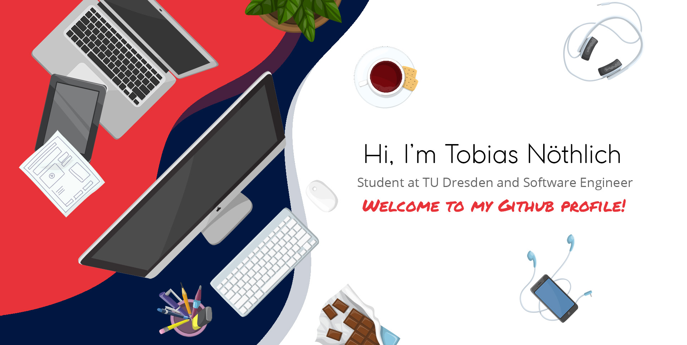

## Key stats

  

 

 

 

## About me:
Hi, I'm Tobias! I am currently a fourth semester CompSci masters student at Dresden University of Technology. In my job at D3TN GmbH, I mainly work with C, Rust and Python, but I also enjoy doing web dev.    
Currently, my main interests are Delay Tolerant Networking as well as Algorithms and Data Structures.
   
When I'm not coding I enjoy reading, playing piano and going to the gym.

## :desktop_computer: Latest projects:

## :hammer_and_wrench: Languages and Frameworks:
### Languages

       

### Frameworks

   

### Tools

    

## :speech_balloon: Get in touch:

 

